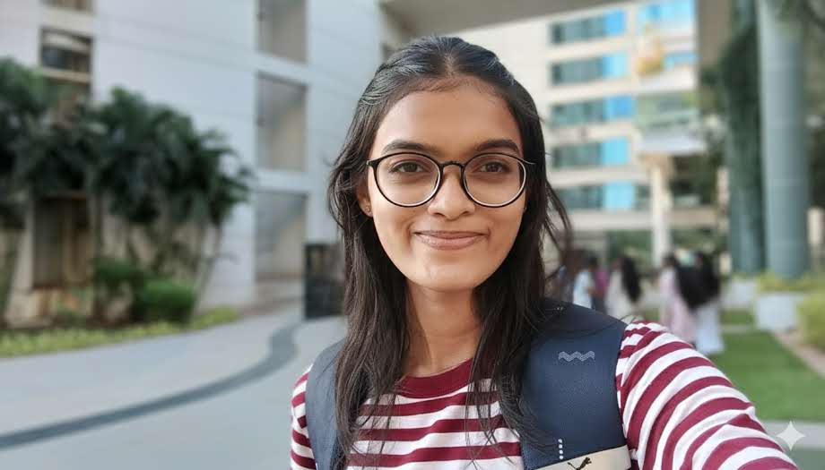

<!-- Profile section -->

  <!-- Left-aligned photo -->
  

  <!-- About text -->
  

    

      Hi! I'm <strong>Shreya Fal Dessai</strong> — an undergraduate science student passionate about 
      <strong>Physics</strong> and exploring interdisciplinary <strong>research</strong>.  
      This portfolio highlights my academic journey, workshops, experiments, and research interests.
    

  

---

## 🧪 Experiments
- 🔬 [View My Physics Experiments →](./experiments.md)

---

## 🧬 Workshops & Seminars
- **Spectroscopy Workshop (2024)** — Hands-on training on using spectrophotometers for absorption studies.  
- **Seminar on Quantum Mechanics** — Explored the probabilistic interpretation of particles and uncertainty.  

---

## 📖 Books & Research Read

### **Books Completed**
- *Introduction to Quantum Mechanics* — D.J. Griffiths  
- *Concepts of Modern Physics* — Arthur Beiser  

### **Currently Reading**
- *Statistical Physics* — F. Reif  

### **Research Papers Read**
- L. Boltzmann (1872): *Weitere Studien über das Wärmegleichgewicht unter Gasmolekülen*  
  - Studied the origin of the H-theorem and entropy concept.  
- A. Einstein (1905): *On the Electrodynamics of Moving Bodies*  
  - Explored time dilation and simultaneity in special relativity.  

---

## 🖼️ Posters Presented
- **Energy Conservation in Physical Systems** — A visual presentation on classical and quantum perspectives.  
- **Light–Matter Interactions** — Illustrated the photoelectric effect and emission spectra.  

---

## 🏅 Certificates

Here are some of my verified workshops and achievements:
## 🏅 Certificates

Recognitions from workshops, seminars, and academic programs that contributed to my scientific learning and outreach experience.

  <!-- Astronomy Certificate -->
  

    
    

      <strong>Astronomy Certificate Course</strong> 
      Association of Friends of Astronomy (Goa) – Public Astronomical Observatory 
      <em>28 Feb 2024 · National Science Day</em>
    

  

  <!-- Materials Science Seminar Certificate -->
  

    
    

      <strong>International Seminar on Advances in Materials (ISAM)</strong> 
      Department of Materials Science, University of Madras 
      <em>7 Oct 2024</em>
    

  

  <!-- Mechanica Workshop Certificate -->
  

    
    

      <strong>Mechanica 2024 — Generative AI Workshop</strong> 
      Techobytes Technologies × MEA IIT Madras Research Park 
      <em>28 – 29 Sept 2024</em>
    

  

---

### 📜 Reflection
Each of these experiences strengthened my academic and practical understanding of science — from hands-on observation at the Public Astronomical Observatory (Goa), to material-science discussions at the University of Madras, to applying emerging AI technologies during Mechanica 2024 at IIT Madras.  
They represent my ongoing engagement with scientific learning and research communities.

  
  
  
  

### 📜 Details

| Certificate | Organizer | Date | Description |
|--------------|------------|------|--------------|
| **Astronomy Certificate Course** | Association of Friends of Astronomy (Goa) | Feb 2024 | Mastered basics of amateur astronomy and sky observation. |
| **International Seminar on Advances in Materials (ISAM)** | Dept. of Materials Science, University of Madras | Oct 2024 | Participated in seminar on material science advancements. |
| **Advanced Tech Workshop Series '24 — Generative AI** | IIT Madras (Techobytes Technologies) | Sept 2024 | Attended AI-focused workshop as part of Mechanica’24. |

---

## 📫 Contact

- 📧 **Email:** [shreya.s.faldessai@gmail.com](mailto:shreya.s.faldessai@gmail.com)  
- 💼 **LinkedIn:** [shreya-fal-dessai-2101-](https://www.linkedin.com/in/shreya-fal-dessai-2101-/)  
- 🧑‍💻 **GitHub:** [shreya-scispace](https://github.com/shreya-scispace)

> “The important thing is not to stop questioning. Curiosity has its own reason for existing.” — *Albert Einstein*
