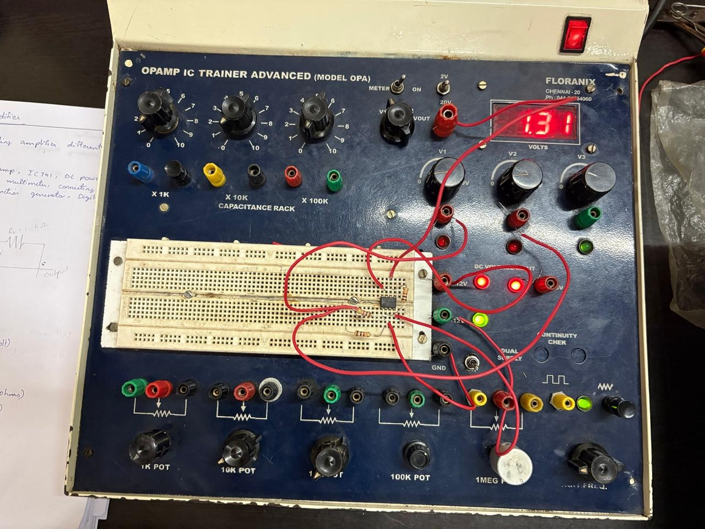

# 🧪 Physics Laboratory Experiments

The following experiments were performed as part of my undergraduate Physics laboratory coursework.  
Each involved hands-on setup, measurement, and analysis to connect theory with practice.

---

## ⚙️ 1. Operational Amplifier (Op-Amp)
**Objective:** To study the characteristics of an operational amplifier as an inverting and non-inverting amplifier.  
**Apparatus:** IC 741, resistors, DC power supply, breadboard, connecting wires, CRO.  
**Procedure Summary:** Configured the Op-Amp in both inverting and non-inverting modes and recorded voltages to determine gain.  
**Observation:** Output voltage varied linearly with input within the active region.  
**Result:** Verified linear amplification and calculated voltage gain for each configuration.  
**Skills Used:** Circuit setup, CRO usage, data analysis.  

📸 **Experiment Setup:**  

  
   
  <em>Figure: Op-Amp Trainer Kit used in the experiment</em>

---

## 🔦 2. Laser Diffraction and Grating
**Objective:** To determine the wavelength of a laser using diffraction through a grating.  
**Result:** Wavelength ≈ 6.32 × 10⁻⁷ m.  
**Concepts:** Diffraction, interference, wave optics.  

---

## 🌌 3. Determination of Rydberg’s Constant
**Objective:** To determine Rydberg’s constant from hydrogen sp
