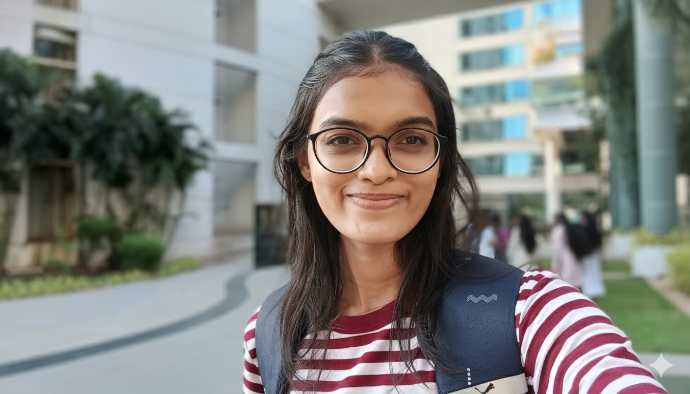
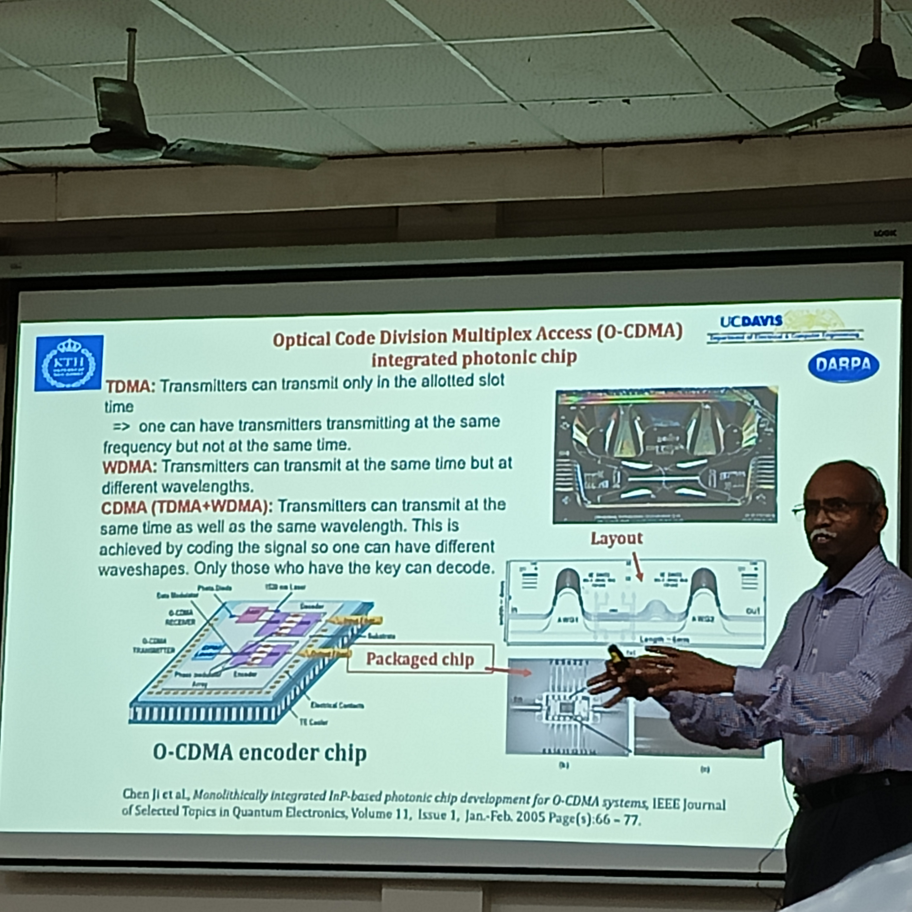

<!-- Profile + About combined -->

  <!-- Profile photo -->
  

  <!-- Intro + About -->
  

    <h2 style="margin-top:0;">Shreya Fal Dessai</h2>
    

      <strong>B.Sc (Blended) – Physics,Chemistry,Mathematics & Biology | University of Madras (UNOM) in collaboration with the University of Melbourne</strong> 
      Passionate about physics and exploring interdisciplinary research. 
      📍 Chennai, India · ✉️ <a href="mailto:shreya.s.faldessai@gmail.com">shreya.s.faldessai@gmail.com</a>
    

    <h3 style="margin-top:1.2em;">About Me</h3>
    

      I’m an undergraduate student deeply interested in <strong>Physics</strong> and 
      <strong>interdisciplinary research</strong>, exploring how thermodynamics and 
      quantum theory explain energy flow, entropy, and organization in living systems.  
      My goal is to bridge physics and biophysics through analytical and experimental approaches.
    

  

---

### 🔭 Current Project
**ESP32 Tank with Thermal Vision Camera**  
An experimental robotic setup combining physics, electronics, and embedded systems to visualize heat signatures and motion. Currently developing and testing with Python.

---
### Research interest
My research interest lies in understanding the thermodynamics of biological systems, focusing on how microstates and entropy shape organization, energy flow, and stability in living matter.
I aim to explore how statistical and quantum thermodynamics can explain the balance between order and disorder in cellular and molecular processes.

---

### 💡 Highlights
- Built and tested small physics experiment setups (Operational amplifier, Laser grating, Photocell).  
- Attended seminars and workshops on optics, lasers, and instrumentation.  
- Currently exploring **Raspberry Pi** and **ESP32** applications in scientific computational modelling.

---
## 🧠 Poster Presentation

*Title:* The Endosymbiosis Theory  
*Event:* B.Sc Blended Poster Exhibition 
*Date:* October 2024
*Role:* Presenter  

I presented a poster on The Endosymbiosis Theory, exploring the evolutionary link between prokaryotic and eukaryotic cells.  
The session included discussions on cellular evolution, symbiotic relationships, and the origin of mitochondria and chloroplasts.

   
  <em>Poster Presentation — Endosymbiosis Theory</em>

   
  <em>B.Sc Blended course dean Dr. Andrew Drinnan</em>

Explaining the concept of endosymbiosis during the interdisciplinary poster exhibition.

---

### 🧬 Research Papers

A curated list of original scientific papers and classical works I’ve studied to understand the evolution of modern physics — from thermodynamics to quantum theory.  
This section reflects how foundational research has shaped my conceptual understanding and guided my coursework in thermal and statistical physics.

### 📖 Classical & Modern Foundations
| **Author / Year** | **Paper / Work** | **Concept** | **Key Insight** |
|--------------------|------------------|--------------|------------------|
| **Ludwig Boltzmann (1872)** | *On the Relation between the Second Law of Thermodynamics and Probability Theory* | Statistical Mechanics | Introduced probabilistic interpretation of entropy, laying the groundwork for kinetic theory. |
| **Max Planck (1900)** | *On the Law of Distribution of Energy in the Normal Spectrum* | Quantum Theory | Proposed energy quantization — the birth of quantum physics. |
| **Albert Einstein (1905)** | *On a Heuristic Point of View Concerning the Production and Transformation of Light* | Photoelectric Effect | Suggested that light is quantized into photons, supporting Planck’s hypothesis. |
| **Albert Einstein (1905)** | *On the Motion of Small Particles Suspended in Liquids at Rest* | Brownian Motion | Provided empirical evidence for atomic theory through molecular motion. |
| **Niels Bohr (1913)** | *On the Constitution of Atoms and Molecules* | Atomic Structure | Developed quantized energy levels for electrons — explaining the hydrogen spectrum. |

### 🔬 Thermal & Statistical Physics
| **Concept Area** | **Key Ideas Explored** | **Relevance to Coursework** |
|------------------|------------------------|------------------------------|
| **Blackbody Radiation & Energy Quantization** | Planck’s distribution law and energy quantization | Thermal Physics — foundation of quantum ideas |
| **Boltzmann Distribution & Entropy** | Connection between microstates, entropy, and thermodynamic probability | Statistical Mechanics |
| **Einstein’s Theory of Specific Heat (1907)** | Quantized oscillator model for solids | Solid-State Physics |
| **Maxwell–Boltzmann Statistics** | Classical particle distribution and its limits | Core principle in Statistical Physics |

---

### 🧠 Literature Review Notes (Ongoing)

**Current Theme:** *Transition from classical to quantum thermodynamics through foundational papers.*

- Compared Planck’s quantization with Boltzmann’s statistical framework.  
- Reviewed Einstein’s derivation for the photoelectric effect and its experimental basis.  
- Studied Bohr’s quantized atom to connect theoretical spectra with observed emission lines.  
- Exploring how entropy and energy quantization underpin living systems in biophysical contexts.

---

> “Science is a way of thinking much more than it is a body of knowledge.” — *Carl Sagan*

### 🧭 Seminars & Workshops

A collection of academic workshops and seminars I have attended — covering topics in modern physics, interdisciplinary science, and research exposure.

---

## ⚙️ Seminars

### 🌌 Seminar on Gravitational Wave Astronomy — Past, Present, and Future

**Organizer:** Chennai Mathematical Institute (CMI) & Indian Institute of Technology Madras (IITM)  
**Venue:** CMI Campus, Chennai  
**Date:** September 2024  
**Role:** Participant  

**Overview:**  
This one-day national workshop introduced participants to the field of **Gravitational Wave Astronomy**, exploring how gravitational waves — ripples in spacetime — are detected using interferometric detectors and what they reveal about **black hole** and **neutron star** mergers.

**Speakers:**
- Prof. **K. G. Arun** (CMI) – *The Landscape of Gravitational Wave Astronomy: Past, Present, and Future*  
- Dr. **Sriramkumar L** (IIT Madras) – *Decoding Cosmic Origins with Rays and Ripples*  
- Dr. **Ajit Mehta** (CMI) – *Ripples in Spacetime: Ten Years of Gravitational-Wave Physics and Astrophysics*

**Reflection:**  
> “This workshop was an inspiring experience that deepened my fascination with astrophysics and the universe’s unseen phenomena.”

**Event Gallery:**
  
*Official posters of the workshop.*

  
*Dr. Sriramkumar L.*

  
*Dr. Ajit Mehta.*

**Key Takeaways:**
- Learned the principles of **LIGO** and gravitational wave detection.  
- Explored **signal “chirps”** from binary mergers and cosmic origins.  
- Understood **data interpretation** in gravitational wave physics.  
- Learned about **India’s contribution** through **LIGO–India**.

---

<!-- CERN Seminar -->

  

    <strong>International Seminar — 70 Years of CERN</strong> 
    Department of Physics, IIT Madras 
    <em>22February 2025</em> 
    Commemorating seven decades of CERN’s contributions to particle physics — discussions on the Large Hadron Collider, Higgs boson discovery, and the future of fundamental research.
  

  

### 🧪 Seminar on Advances in Material Science

**Organizer:** Department of Physics, University of Madras  
**Date:** July 2024  
**Role:** Attendee  

**Overview:**  
A departmental workshop exploring recent research and experimental techniques in **nanomaterials** and **quantum materials**. Sessions discussed how modern materials shape advancements in electronics, photonics, and interdisciplinary physics.

**Key Learnings:**
- Understood the role of **material microstructures** in physical properties.  
- Gained awareness of interdisciplinary applications in **quantum devices** and **biomaterials**.  
- Observed research poster sessions and interacted with faculty from IISc and IITM.

  

  

---

## 🎓Workshop
| **Mechanica 2024 — Generative AI Workshop** Techobytes Technologies × MEA IIT Madras Research Park <em>28–29 Sept 2024</em> | IIT Madras (Techobytes Technologies) | Sept 2024 |  |

---

## 🏛️ Campus Visits & Outreach

Exploring scientific institutions, research facilities, and outreach programs to gain exposure to diverse areas of physics and interdisciplinary science.

### 🔬 Indian Institute of Science (IISc), Bengaluru
**Date:** February 2025  
**Focus:** Experimental Physics | Research Environment | Campus Exposure  

Visited IISc as part of an academic outreach initiative. Explored advanced research labs, interacted with scholars, and viewed poster presentations on current physics research.

**Highlights:**
- Observed lab setups for optics and spectroscopy  
- Understood experimental procedures and data recording  
- Explored the campus and historic research facilities  

**Photo Highlights:**

 
*experimental setups.*

 
*Poster display.*

 
*The green academic environment of IISc.*

---

### 🧪 Central Leather Research Institute (CLRI), Chennai
**Date:** August 2024  
**Focus:** Analytical Instruments 

Visited CLRI to explore interdisciplinary applications of physics in biomaterials and research instrumentation.

**Highlights:**
- Observed **aerodynamics and structural testing** setups used in material research.  
- Learned how **wind tunnels and vibration systems** simulate stress and airflow dynamics.  
- Explored **model prototypes** for testing architectural and industrial designs.  
- Gained insights into **instrumentation and materials testing techniques** relevant to applied physics.
- Learned modern methods of plastic waste management  

**Photo Highlights:**
 
*Demonstration of lab instruments during the visit.*

---

> These visits and outreach programs offered valuable real-world perspectives on how research connects with learning — strengthening my motivation to pursue physics and biophysical studies.

---

## 🏅 Certificates

Recognitions from workshops, seminars, and academic programs that contributed to my scientific learning and outreach experience.

| Certificate | Organizer | Date | Preview |
|--------------|------------|------|----------|
| **Astronomy Certificate Course** Association of Friends of Astronomy (Goa) <em>28 Feb 2024 · National Science Day</em> | Association of Friends of Astronomy (Goa) | Feb 2024 |  |
| **International Seminar on Advances in Materials (ISAM)** Department of Materials Science, University of Madras <em>7 Oct 2024</em> | Dept. of Materials Science, University of Madras | Oct 2024 |  |
| **Mechanica 2024 — Generative AI Workshop** Techobytes Technologies × MEA IIT Madras Research Park <em>28–29 Sept 2024</em> | IIT Madras (Techobytes Technologies) | Sept 2024 |  |

---

### 📜 Reflection

Each of these experiences strengthened my academic and practical understanding of science — from hands-on observation at the Public Astronomical Observatory (Goa), to material-science discussions at the University of Madras, to applying emerging AI technologies during Mechanica 2024 at IIT Madras.  

They represent my ongoing engagement with scientific learning and research communities.

### 🧰 Skills & Tools
`Gen AI` · `Python` · `Raspberry Pi` · `ESP32` · `Sensors` 

---

### 📫 Contact
- Email: [shreya.s.faldessai@gmail.com](mailto:shreya.s.faldessai@gmail.com)  
- GitHub: [github.com/shreya-scispace](https://github.com/shreya-scispace)  
- LinkedIn: [linkedin.com/in/shreya-fal-dessai-2101-](https://linkedin.com/in/shreya-fal-dessai-2101-)

---

