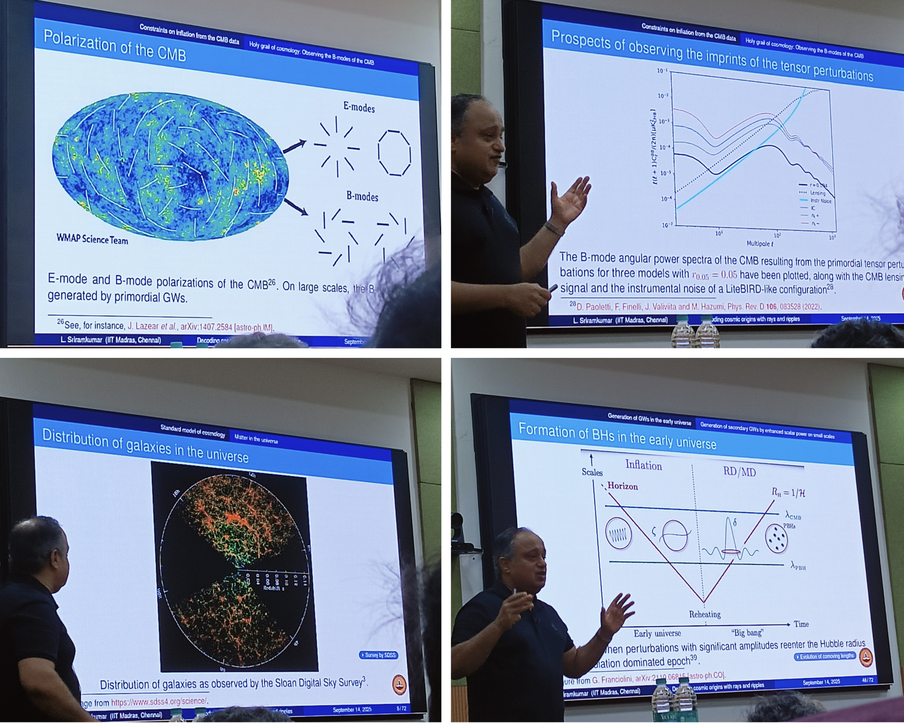
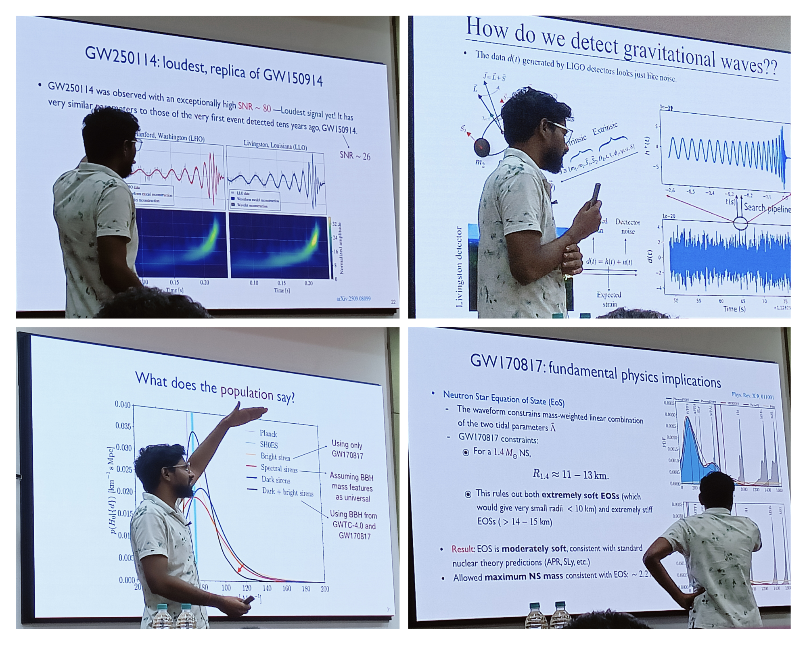
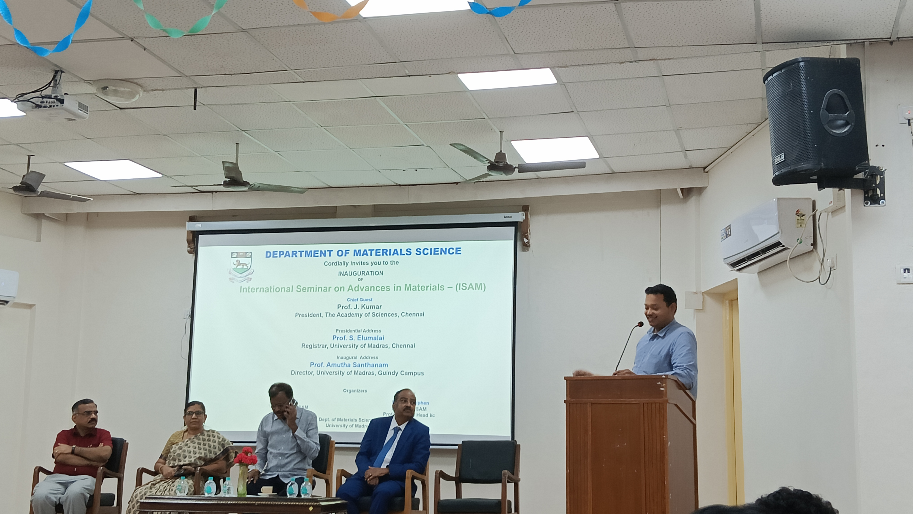
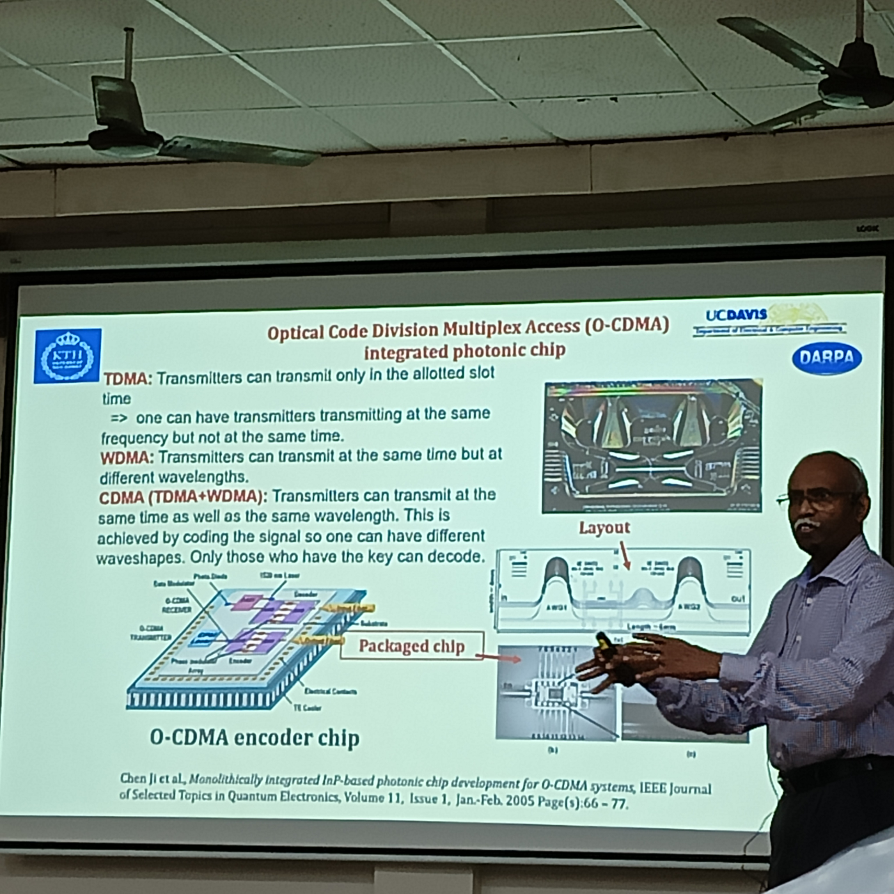

<!-- SEMINARS -->
<section class="section" id="seminars">
  <h2>Seminars</h2>

  <!-- Gravitational Wave Seminar -->
  

    <strong>Gravitational Wave Astronomy — Past, Present, and Future</strong> 
    <em>Chennai Mathematical Institute (CMI) & IIT Madras · September 2024</em>

    

      A one-day national seminar introducing the fundamentals of gravitational-wave
      detection, interferometry, and astrophysical sources such as black hole and
      neutron star mergers. The seminar also discussed India’s role in
      <strong>LIGO–India</strong>.
    

    
<strong>Speakers:</strong>

    <ul>
      <li>Prof. K. G. Arun (CMI)</li>
      <li>Dr. Sriramkumar L (IIT Madras)</li>
      <li>Dr. Ajit Mehta (CMI)</li>
    </ul>

    
<strong>Event Gallery:</strong>

    

       
      <em>Official posters of the seminar</em>
    

    

       
      <em>Lecture session</em>
    

    

       
      <em>Expert talk on gravitational-wave physics</em>
    

  

  <!-- CERN Seminar -->
  

    <strong>International Seminar — 70 Years of CERN</strong> 
    <em>Department of Physics, IIT Madras · February 2025</em>

    

      An international seminar commemorating seven decades of CERN’s contributions
      to particle physics. Discussions covered the Large Hadron Collider, the Higgs
      boson discovery, and future directions in fundamental research.
    

    

       
      <em>Seminar poster — 70 Years of CERN</em>
    

  

  <!-- Materials Science Seminar -->
  

    <strong>Seminar on Advances in Material Science</strong> 
    <em>Department of Materials Science, University of Madras · July 2024</em>

    

      A departmental seminar exploring recent advances in nanomaterials, quantum
      materials, and interdisciplinary applications of physics in modern materials
      research.
    

    
<strong>Key Learnings:</strong>

    <ul>
      <li>Role of microstructure in determining physical properties</li>
      <li>Applications of quantum materials</li>
      <li>Interdisciplinary relevance to applied physics</li>
    </ul>

    

       
      <em>Seminar session — Materials Science</em>
    

    

       
      <em>Discussion and interaction</em>
    

  

</section>
